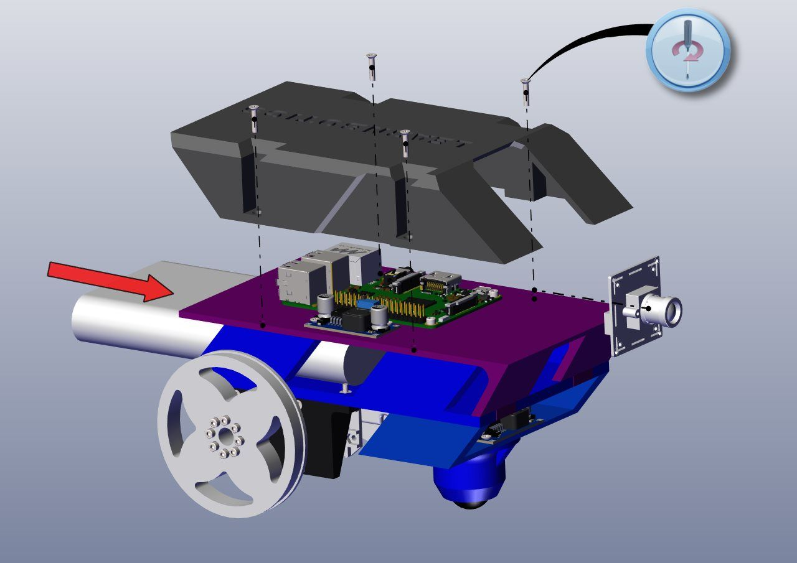

# learning_bot
## Learning Bot

### The challenge
Learnbotics is a platform that is being developed to teach robotics and does not yet have a simulation model available in Gazebo.

It's suggested to read the following tutorials as a first start on Gazebo robot constructions:

#### Beginner: Model Editor

http://gazebosim.org/tutorials?cat=guided_b&tut=guided_b3

#### Conhecendo seu robô

https://github.com/leo5on/Learnbotics/wiki/Conhecendo-seu-Rob%C3%B4

These two links were the guidelines for construction of the robot.

#### Meshes

https://github.com/leo5on/Learnbotics/tree/develop/stl

Were used theses meshes with the help of the https://onshape.com online software CAD. These were the original meshes, but in this example there are new ones.

#### Intermediate: Velodyne

http://gazebosim.org/tutorials?cat=guided_i&tut=guided_i1

#### Connect to ROS

http://gazebosim.org/tutorials?cat=guided_i&tut=guided_i6

### Added references

#### Velodyne plugin by Dataspeed Inc.

https://bitbucket.org/DataspeedInc/velodyne_simulator/src/master/

#### Differential drive plugin by OpenSourceRoboticsFundation.

https://bitbucket.org/osrf/gazebo/src/default/plugins/DiffDrivePlugin.hh

https://bitbucket.org/osrf/gazebo/src/default/plugins/DiffDrivePlugin.cc

## How to simulate

Clone the workspace on your desired location.

### Terminal 1

$ cd learning_bot
$ catkin_make
$ source devel/setup.bash
$ roslaunch robot_diff_gazebo gazebo.launch

This terminal opens the Gazebo software, so it can simulate the model on a empty world and put models and meshes for the robot to interact.

### Terminal 2

$ cd learning_bot
$ source devel/setup.bash
$ roslaunch robot_diff_description robot_diff_rviz.launch

This terminal opens the RViz software, that is a graphic representation of the Gazebo world. There you can see the links and joints of robot, and the representation of camera and lidar.

## Edit preferences

You can open the urdf file in /src/robot_diff_description/urdf/robot_diff.urdf and change some properties, like angular velocity of lidar, or number of samples of the laserscan from lidar. They are referenced on their own <gazebo> block.
